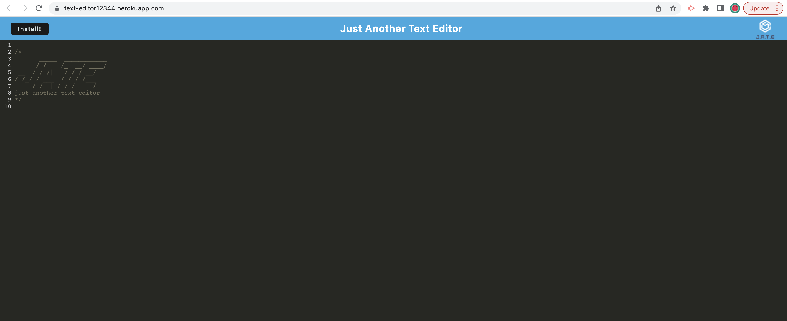

# 19 Progressive Web Applications (PWA): Text Editor

## Badges
  [](https://opensource.org/licenses/ISC)

  ## Table of Contents
  * [License](#license)
  * [Description](#description)
  * [Installation](#installation)
  * [Usage](#usage)
  * [Questions](#questions)

  ## License
  Read more about ISC here:
  [ISC] (https://opensource.org/licenses/ISC)

  ## Description
  For this app we will be building a text editor that runs in the browser. The app will be a single-page application that meets the PWA criteria. Additionally, it will feature a number of data persistence techniques that serve as redundancy in case one of the options is not supported by the browser. The application will also function offline.

  ## Installation
  1. Download the starter code from GitHub.
  2. Install dependencies using "npm install" 
  3. To invoke the app run:
  ``` npm start``` 

  ## Usage
 To use this app go to the link provided below. For offline use, go to the link and hit the "install" button to install the app locally, for offline use.

  

 The following image shows the applicatiion's manifest.js:

 

 The following image shows the application's service worker:

 

 The following image shows the application's IndexDB storage:

  

  ## Questions?
  ### Reach me here: 
  [claire-max](https://github.com/claire-max)  
